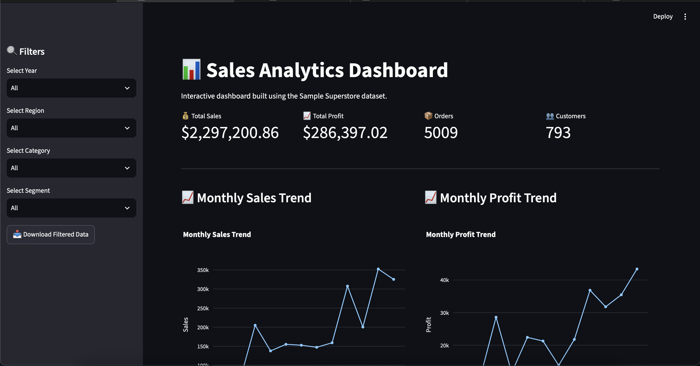
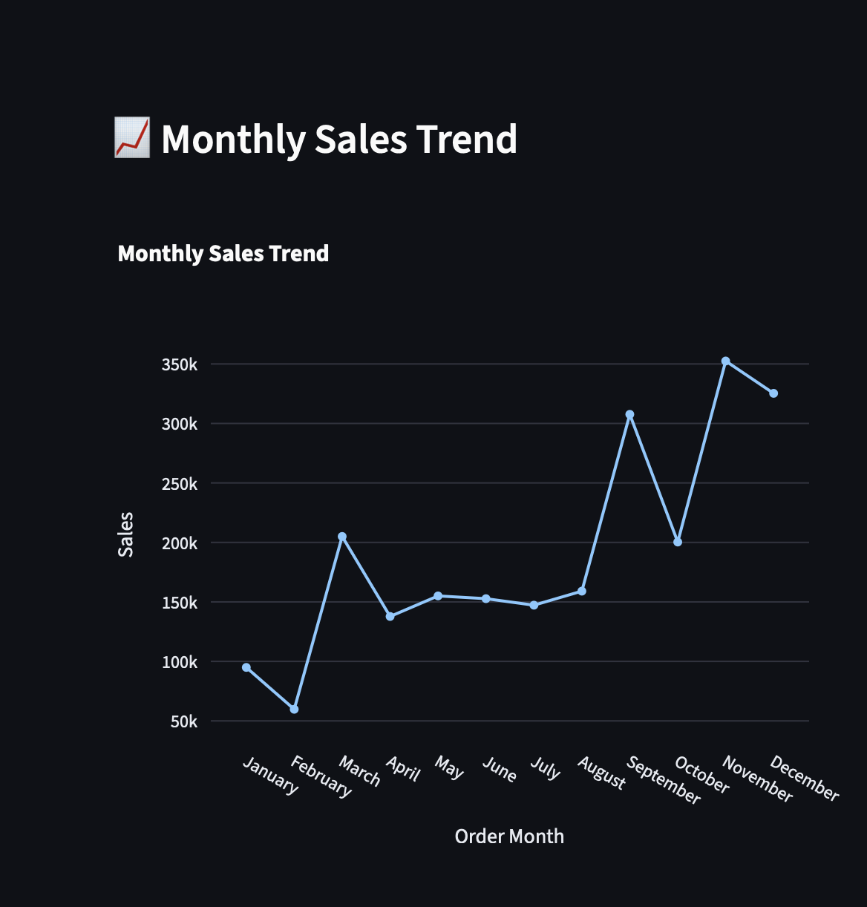
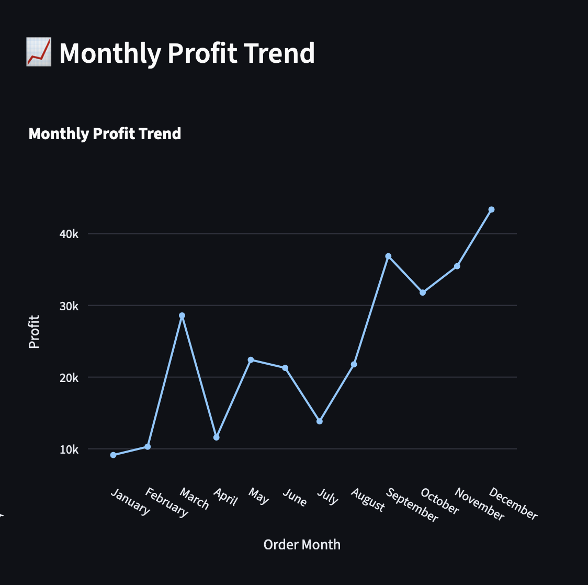
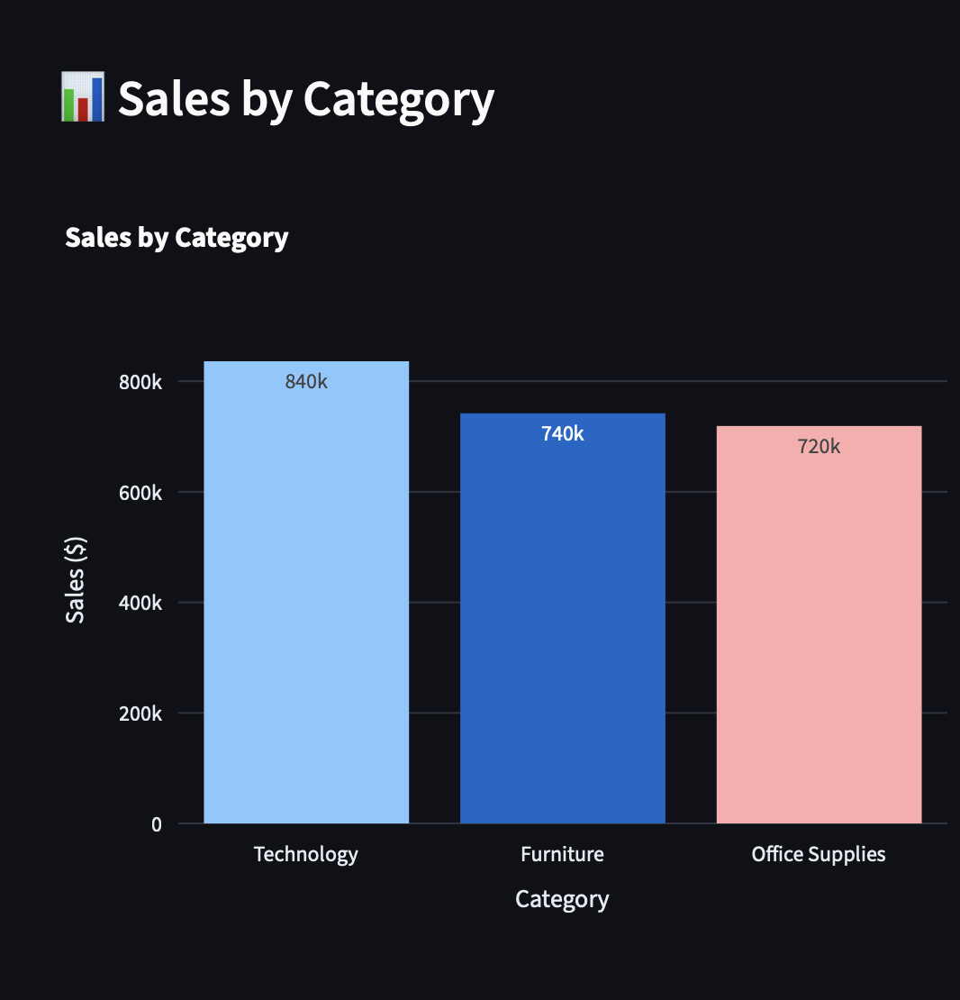
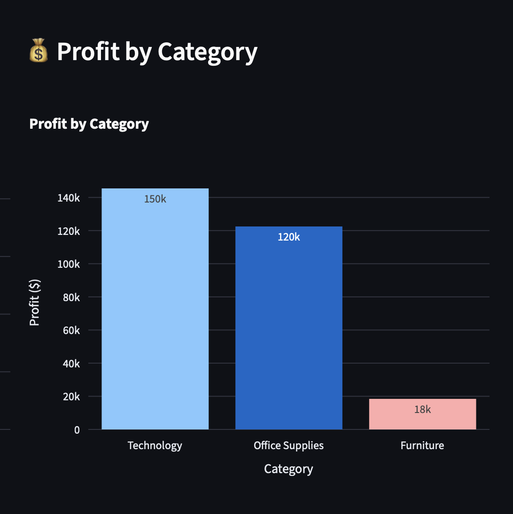
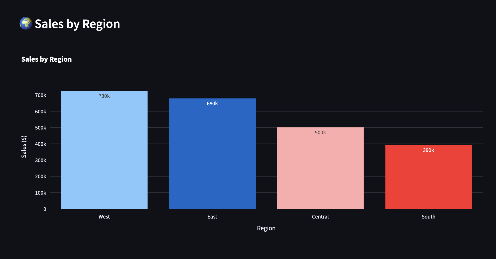
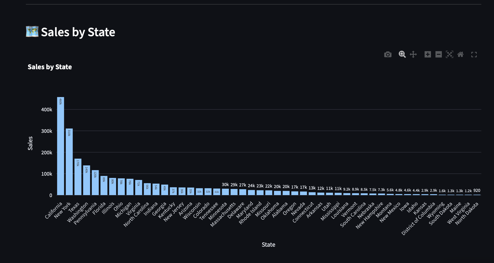
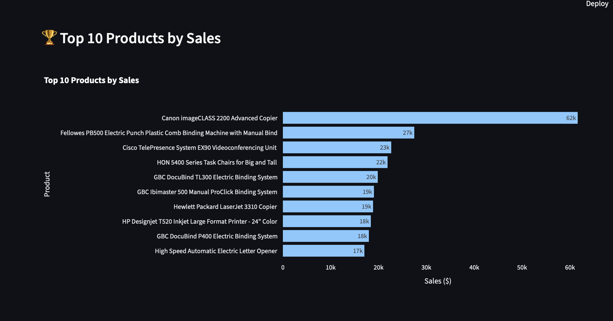

# Sales Analytics Dashboard

An interactive Sales Analytics Dashboard developed using **Python**, **Streamlit**, **Pandas**, and **Plotly** to analyze sales performance, profitability, customer behavior, and regional trends using the Sample Superstore dataset.

---

## Overview

This project provides a comprehensive dashboard for analyzing retail sales data through interactive visualizations and key business metrics. It enables users to monitor sales performance, identify profitable categories, evaluate customer purchasing behavior, and explore regional sales trends using dynamic filters.

The dashboard is designed to support data-driven decision-making by transforming raw transactional data into meaningful business insights.

---

## Features

### Key Performance Indicators

- Total Sales
- Total Profit
- Total Orders
- Total Customers
- Average Order Value
- Average Discount
- Profit Margin

### Interactive Visualizations

- Monthly Sales Trend
- Monthly Profit Trend
- Sales by Category
- Profit by Category
- Sales by Region
- Top 10 Products by Sales
- Top 10 Customers by Sales
- Sales by State
- Discount vs Profit Analysis

### Interactive Filters

- Year
- Region
- Category
- Customer Segment

### Additional Features

- Download filtered data as CSV
- Interactive Plotly visualizations
- Responsive dashboard layout
- Cached data loading for improved performance

---

## Technologies Used

- Python
- Streamlit
- Pandas
- Plotly
- NumPy

---

## Project Structure

```text
sales_dashboard/
│
├── data/
│   └── Sample_Superstore.xls
│
├── screenshots/
│   ├── SalesAnalyticsDashboard.png
│   ├── monthly_trends.png
│   ├── MonthlyProfitTrend.png
│   ├── SalesByCategory.png
│   ├── profitByCategory.png
│   ├── SalesByRegion.png
│   ├── SalesByState.png
│   └── top10_products.png
│
├── app.py
├── analytics.py
├── data_loader.py
├── preprocessing.py
├── visualizations.py
├── requirements.txt
├── README.md
└── .gitignore
```

---

# Dashboard Preview

## Dashboard Overview



---

## Monthly Sales Trend



---

## Monthly Profit Trend



---

## Sales by Category



---

## Profit by Category



---

## Sales by Region



---

## Sales by State



---

## Top 10 Products



---

## Business Insights

The dashboard enables users to:

- Analyze monthly sales and profit trends
- Compare category-wise sales and profitability
- Evaluate regional business performance
- Identify top-performing products and customers
- Analyze sales across different states
- Understand the impact of discounts on profitability
- Filter insights dynamically using multiple business dimensions

---

## Installation

Clone the repository:

```bash
git clone https://github.com/Awinthika/sales-analytics-dashboard.git
```

Navigate to the project folder:

```bash
cd sales-analytics-dashboard
```

Install the required dependencies:

```bash
pip install -r requirements.txt
```

Run the application:

```bash
streamlit run app.py
```

---

## Dataset

This project uses the **Sample Superstore** dataset containing information about:

- Orders
- Customers
- Products
- Categories
- Regions
- States
- Sales
- Profit
- Discounts
- Shipping Details

---

## Future Enhancements

- Sales Forecasting using Machine Learning
- Customer Segmentation
- Geographic Map Visualizations
- Database Integration (MySQL/PostgreSQL)
- Export Reports as PDF
- Role-Based User Authentication

---

## Author

### Awinthika Santhanam


---

## License

This project is intended for educational and portfolio purposes.
